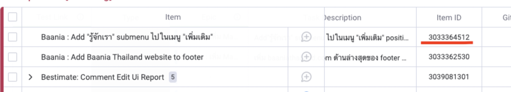

## Grooming session

After requirements are confirmed with PM, tickets can be groom with team.
Voting point:

- 1 point = 1 manday
- 1 sprint has 5 mandays

** So 1 dev can work upto 5 points.
Ref: https://www.visual-paradigm.com/scrum/what-is-story-point-in-agile/

## How to manage tasks on Monday?

| Status             | Action                                                                       |
|--------------------|------------------------------------------------------------------------------|
| To do              | Ticket ready to dev                                                          |
| In progress        | **Dev** start working on the ticket                                          |
| Waiting for review | Dev done and assign ticket to **reviewer**                                   |
| Request change     | Code review failed, assign back to **dev**                                   |
| Ready for test     | Code merged to **dev**, assigned to dev to recheck if merging is successful. |
| QA in progress     | Assign to **QA** to Functionality on dev site                                |
| Test fail          | Found bug, assign back to **dev**                                            |
| Done               | **QA** move to done, dev and test done.                                      |

Test link : link on devsite
Release link: link when create PR to master
Release tag: Release version to Production, add tag when merge to master ex. BN-0.0.0  (see tag label below)

## When create new branch

Create with item id, then it will automatically link new branch to the ticket when push to Github

## Release tag label

| Product              | Tag-\<version\> |
|----------------------|-----------------|
| Baania               | BN              |
| Baania Manage        | BNM             |
| Baania Data Op       | BND             |
| Baania Search Ads    | BNS             |
| Bestimate Corporate  | BTC             |
| Bestimate Individual | BTI             |
| Bestimate Admin      | BTA             |
| Prop2Share           | P2S             |
| Prop2Share Admin     | P2SA            |
| Data Pool            | DP              |
| Data Pool Admin      | DPA             |

## Creating Deployment For production

Once branch is tested all resolve, to push to master we will use release branch

Check out master branch into release version
1. Merge branches that include in the version into release
2. Open pull request into master branch
3. QA test on the branch until it is ready
4. Merge into master branch
5. Test again to confirm everything is working correctly
